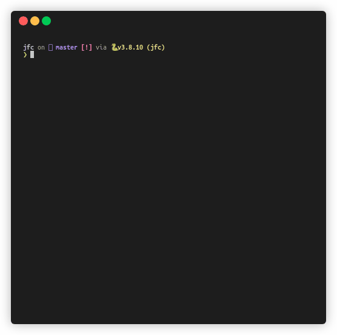

# Journal Fabulous Club

`jfc` is an utility to make reviewing ArXiv papers for your Journal Club easier.



## Install

**Consider using [`pipx`][pipx].**

```bash
pipx install git+https://github.com/mikeevmm/jfc/
```

Otherwise, if you are using `pip`:

```bash
pip install git+https://github.com/mikeevmm/jfc/
```

## How to Use

`jfc` aggregates unseen articles from the specified timeframe (see the
[configuration](##configuration) section), and displays them to you in an
interactive prompt. From the title, you can choose to read the abstract, and
from there you can choose to open the ArXiv PDF.

Run `jfc` to get an interactive prompt.

## Configuration

`jfc` has some configuration parameters, which are set in the [TOML][TOML] file
that lives in the configuration directory (as reported by [`appdirs`][appdirs].

Running `jfc config` will output the full directory of the configuration
directory. Since most editors accept a path as an argument for the file to open,
this means you can quickly edit the configuration (in bash) with

```bash
<your favourite editor> $(jfc config)
```

To clean the configuration and/or article database, run one of 

```bash
jfc clean conf
jfc clean db
jfc clean all
```

A copy of the old files is kept with a `.old` extension, so that these can be
recovered. In particular, your old configuration can be recovered (in bash)
with

```bash
mv "$(jfc config).old" "$(jfc config)"
```

### Parameters

 * `span` The timeframe of publication dates to aggregate, in days, and
    counting backwards from today. [Default: 7]
 * `show_header` Whether to be boring (`false`) or not (`true`) [Default: true]
 * `[categories]` Set each item below it to `true` to include it in the ArXiv
    search. Every element defaults to `false`, except `quant-ph`, which defaults
    to `true`.
   + `cs`
   + `econ`
   + `eess`
   + `math`
   + `astro-ph`
   + `cond-mat`
   + `gr-qc`
   + `hep-ex`
   + `hep-lat`
   + `hep-ph`
   + `hep-th`
   + `math-ph`
   + `nlin`
   + `nucl-ex`
   + `nucl-th`
   + `physics`
   + `quant-ph`
   + `q-bio`
   + `q-fin`
   + `stat`

## Contributing

Pull requests are welcome. Issues are not guaranteed to be addressed. `jfc` is
built primarily for self-use, provided to you for free, and not my primary
occupation. Please respect this.

## Licence

`jfc` is licenced under a GNU General Public License, version 3. This
[**informally**][GPLv3] means that:

> You may copy, distribute and modify the software as long as you track
> changes/dates in source files. Any modifications to or software including
> (via compiler) GPL-licensed code must also be made available under the GPL
> along with build & install instructions.

You can find a copy of the licence under `LICENCE`.

## Support

We're all poor students, so we know how this goes. Nonetheless, getting
donations, no matter how small, lets me know that people use and appreciate the
software I've published.

💕 If you like and use `jfc`, consider
[buying me a coffee](https://www.paypal.me/miguelmurca/2.50).

[pipx]: https://github.com/pypa/pipx
[appdirs]: https://pypi.org/project/appdirs/
[TOML]: https://en.wikipedia.org/wiki/TOML
[GPLv3]: https://tldrlegal.com/license/gnu-lesser-general-public-license-v2.1-(lgpl-2.1)
